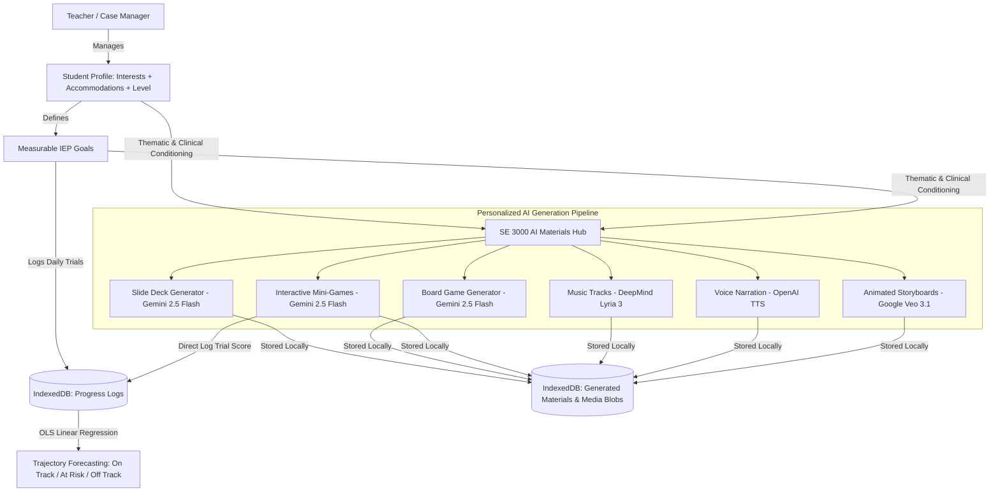

# Special Ed 3000 🚀

[](https://nextjs.org/)
[](https://react.dev/)
[](https://www.typescriptlang.org/)
[](https://tailwindcss.com/)
[](https://dexie.org/)
[](https://opensource.org/licenses/MIT)

> **Special Ed 3000** is a local-first, privacy-focused AI workstation designed for special education case managers, therapists, and resource teachers. It seamlessly pairs **IEP goal progress tracking** (with linear regression trend forecasting) with an **AI-powered teaching materials generator** producing individualized lessons, board games, mini-games, songs, read-along narrations, and video storyboards **hyper-personalized to each student's unique passions, reading level, communication supports, and sensory profile.**

---

## 🎯 Hyper-Personalized to Every Student's Passions & Needs

Generic worksheets and one-size-fits-all curriculum often fail to engage students with diverse learning needs. **Special Ed 3000 solves this by using AI to dynamically craft custom learning materials conditioned on the student's complete individual profile:**

```
   Student Passions & Motivators          Individual Learning Profile              Target IEP Goal
(Dinosaurs, Minecraft, Space, Robots) + (Reading Level, Sensory, AAC, Modality) + (Measurable Target & Criteria)
                                                   │
                                                   ▼
                     ┌───────────────────────────────────────────────────────────┐
                     │           Special Ed 3000 Generation Engine               │
                     └───────────────────────────────────────────────────────────┘
                                                   │
         ┌──────────────────┬──────────────────────┼──────────────────┬──────────────────┐
         ▼                  ▼                      ▼                  ▼                  ▼
   📑 Slide Decks     🎲 Board Games        🎮 Mini-Games      🎵 Lyria Songs     🎙️ Narrations
(Thematic Lessons) (Custom Cards & Board) (Playable Web Games) (Mnemonic Jingles) (Read-Along Audio)
```

### How Special Ed 3000 Personalizes Every Material:

1. **❤️ Passions & High-Interest Themes**: Every game clue, word problem, slide narrative, and song lyric is woven around what the student genuinely loves (e.g. *Dinosaurs, Minecraft, Space Exploration, Train Schedules, Lego*). High-interest themes dramatically boost focus and task engagement.
2. **📚 Calibrated Reading & Comprehension Levels**: Content is generated precisely at the student's instructional reading level (e.g. *Pre-reader, Early 2nd Grade vowel digraphs, 4th Grade sight words*), preventing frustration and cognitive overload.
3. **💬 Communication Support Integration**: Adapts instructions for verbal students, AAC device users, PECS / picture exchange systems, visual storyboards, and sign language supports.
4. **🎧 Sensory & Modality Accommodations**: Built-in calming sensory break tiles on board games, clutter-free high-contrast slide layouts for visual sensitivities, and auditory read-aloud support.
5. **🎯 Direct Goal Alignment**: Every challenge card, quiz prompt, and practice step directly targets the student's measurable IEP benchmark (e.g. *"80% reading accuracy in 4/5 trials"* or *"3 peer social initiations per 30-min period"*).

### Example: Same Goal Skill, Two Completely Personalized Experiences

| Student Profile | Passion / Theme | Generated Lesson Deck | Generated Mini-Game | Generated Lyria Song |
| :--- | :--- | :--- | :--- | :--- |
| **JD (Grade 3, SLD)**<br>• Reading: Early 2nd Grade<br>• Needs: Visual supports, fidgets | **Dinosaurs & Fossil Digs** 🦖 | *"Dino Dig: Vowel Digraph Phonics Adventure"* (Chunked sentences, paleontologist guide) | *"Dino Vowel Matcher"* (Match fossil clues to long-vowel dinosaur words) | *"Dino Vowel Team Anthem"* (Upbeat acoustic rhyming jingle) |
| **MR (Grade 5, ASD)**<br>• Reading: 4th Grade<br>• Needs: Visual rules, calm lighting | **Minecraft & Spacecraft** 🚀 | *"Galactic Builder: Peer Communication Quest"* (Visual dialogue steps & choice boards) | *"Space Sorter"* (Categorize social greetings vs solitary actions) | *"Peaceful Focus Orbit"* (68 BPM calming lo-fi study audio) |

---

## 🌟 Key Highlights

- **🔒 Local-First & 100% Private**: All student profiles, goal data, progress logs, and generated materials are stored in the browser's **IndexedDB** (via Dexie.js). No student PII is ever uploaded to a cloud database.
- **📈 IEP Progress Monitoring & Trajectory Forecasting**: Log dated observation trials against measurable goals. Automatic **Ordinary Least-Squares (OLS) linear regression** evaluates trajectory and flags whether the student is *On Track 🟢*, *At Risk 🟡*, or *Off Track 🔴* toward their review deadline.
- **🧠 Rich Student Learning Profiles**: Captures reading/decoding levels, comprehension capabilities, communication accommodations (Verbal, AAC, PECS, Visual Supports), sensory considerations, and personal motivators.
- **🎨 Multi-Format AI Materials Hub**: Generates 6 individualized curriculum formats with consistent thematic conditioning:
  1. **Instructional Slide Decks**: Multi-slide lessons with comprehension checks, teacher notes, speech synthesis read-aloud, and PDF print export.
  2. **Printable Board & Card Games**: Thematic pathway board with interactive dice simulator, challenge cards with evaluation rubrics, and printable 8.5×11 cut-out sets.
  3. **Interactive Browser Mini-Games**: 4 playable in-browser engines (*Pair Matching, Category Sorting, Multiple Choice Quiz, Step Sequencer*) with a one-click *"Log Score to IEP Progress"* button.
  4. **Lyria 3 Music Tracks**: Mnemonic rhyming songs, calming focus lo-fi audio, and victory fanfares with lyrics/chords viewer and Web Audio harmonic synthesis.
  5. **Read-Along Narration**: OpenAI TTS (`tts-1`) voiceover with real-time sentence-by-sentence read-along highlighting and speed controls (0.75×–1.2×).
  6. **Veo 3.1 Animated Storyboards**: Scene-by-scene animation scripts with synchronized narration cues and timeline playback.
- **📝 Audit-Ready Progress Summaries**: One-click generation of plain-language, audit-compliant progress paragraphs ready for IEP progress reports.
- **🛡️ Resilient Offline Fallback**: Includes high-fidelity built-in curriculum synthesizers so all features and interactive games work seamlessly offline or before API keys are added.

---

## 🏗️ Architecture & Data Flow



---

## 🚀 Getting Started

### Prerequisites

- [Node.js](https://nodejs.org/) v18.18.0 or newer
- `npm`, `pnpm`, or `yarn`

### 1. Clone the Repository

```bash
git clone https://github.com/your-username/special-ed-3000.git
cd special-ed-3000
```

### 2. Install Dependencies

```bash
npm install
```

### 3. Configure API Keys (Optional)

The application includes built-in offline synthesizers, so every feature works with zero keys configured. To connect live models, create a `.env.local` file in the root directory:

```bash
cp .env.example .env.local
```

`.env.example` documents every supported provider — add only the ones you have keys for:

| Capability | Providers (tried in priority order, configurable on the **Settings** page) |
| :--- | :--- |
| Text generation | Google Gemini → DeepSeek → Kimi (Moonshot AI) → OpenAI |
| Text-to-speech narration | OpenAI TTS → MiniMax Speech |
| Real video generation | MiniMax Hailuo → Kling AI |
| Real music generation | MiniMax Music |

Any subset may be configured — unconfigured providers are skipped automatically, falling all the way back to the offline synthesizer if none are set.

> 🔒 **Security Notice:** `.env*` files are included in `.gitignore` and are never committed. API keys are accessed strictly on the server-side via Next.js API routes — the browser never sees them.

### AI Settings & Usage Tracking

Open the **Settings** button in the top nav (or [http://localhost:3000/settings](http://localhost:3000/settings)) to:
- Reorder each capability's provider priority (which providers actually get used still depends on which keys you've configured in `.env.local`)
- See at a glance which providers are configured, without ever exposing key values
- Track every generation's estimated cost, grouped by provider and by feature, with a running activity log

All of this is stored locally in the browser (IndexedDB) alongside the rest of SE 3000's local-first data — nothing is sent anywhere except the generation request itself.

### 4. Run the Development Server

```bash
npm run dev
```

Open [http://localhost:3000](http://localhost:3000) in your browser.

### 5. Production Build

```bash
npm run build
npm start
```

---

## 📂 Project Structure

```
special-ed-3000/
├── app/
│   ├── api/generate/           # Server-side AI generation endpoints
│   │   ├── board-game/route.ts # Board game generator (Gemini 2.5 Flash)
│   │   ├── mini-game/route.ts  # Browser mini-game generator (Gemini 2.5 Flash)
│   │   ├── music/route.ts      # Lyria 3 music synthesizer
│   │   ├── narration/route.ts  # OpenAI TTS audio generator
│   │   ├── slides/route.ts     # Slide deck generator (Gemini + Imagen)
│   │   └── video/route.ts      # Veo 3.1 video storyboard generator
│   ├── globals.css             # Tailwind v4 theme & CSS variables
│   ├── layout.tsx              # Root HTML shell & metadata
│   └── page.tsx                # Main SE 3000 workstation dashboard
├── components/
│   ├── materials/              # Dedicated interactive viewers & players
│   │   ├── AudioMusicPlayer.tsx   # Lyria music visualizer & lyrics sheet
│   │   ├── BoardGameViewer.tsx    # Interactive & printable board game kit
│   │   ├── MiniGamePlayer.tsx     # 4 in-browser game engines with trial logger
│   │   ├── NarrationPlayer.tsx    # Read-along audio player with sentence tracking
│   │   ├── SlideDeckViewer.tsx    # Slide presenter with speech synthesis
│   │   └── VideoPlayer.tsx        # Veo video storyboard timeline player
│   ├── AccommodationList.tsx   # Categorized accommodation matrix
│   ├── AddGoalForm.tsx         # Measurable IEP goal creation modal
│   ├── AddStudentForm.tsx      # Student & Learning Profile creation modal
│   ├── GoalCard.tsx            # Goal progress card with chart & log form
│   ├── MaterialGeneratorModal.tsx # Unified AI Materials Hub modal
│   ├── MaterialsGallery.tsx    # Student materials library & filter tabs
│   ├── ProgressChart.tsx       # Lightweight canvas-based line chart
│   ├── ProgressSummary.tsx     # Plain-language IEP progress report modal
│   ├── ServiceTracker.tsx      # Mandated vs delivered therapy minutes table
│   └── StudentHeader.tsx       # Student profile banner & learning tags
├── lib/
│   ├── db.ts                   # Dexie.js IndexedDB schema & database instance
│   ├── materials.ts            # Client-side generator caller & blob manager
│   ├── seed.ts                 # Realistic placeholder students (JD, MR) & sample assets
│   ├── summary.ts              # IEP progress summary narrative generator
│   ├── trending.ts             # OLS linear regression & trajectory classification
│   └── generators/
│       └── context.ts          # Standardized generation context builder
└── types/
    └── iep.ts                  # TypeScript interfaces & domain models
```

---

## 🤖 AI Models & Workload Split

Every row below is a fallback chain, not a single hard-coded model — SE 3000 tries each provider in order (configurable on the **Settings** page) and skips any without a configured key, all the way down to an offline synthesizer.

| Capability | Providers tried in order | Est. Cost / Gen |
| :--- | :--- | :--- |
| **Lesson & Game Structured Text** | Gemini 2.5 Flash → DeepSeek Chat → Kimi K2 → GPT-4o-mini | ~$0.003 – $0.02 |
| **Slide Illustrations & Game Art** | Imagen 3 (Google AI Studio) | ~$0.02 – $0.03 |
| **Mnemonic Songs & Calming Audio** | Lyria 3-style lyrics/structure (text chain above); real audio via MiniMax Music | ~$0.04 – $0.08 (text) / ~$0.05 (real audio) |
| **Animated Explainer Clips** | Veo 3.1-style storyboard script (text chain above); real video via MiniMax Hailuo → Kling AI | ~$0.40 (script) / ~$0.35 – $0.50 (real video) |
| **Voiceover Narration (TTS)** | OpenAI `tts-1` → MiniMax Speech (T2A v2) | ~$0.006 – $0.01 / script |

---

## 🧪 Testing & Verification

Run the TypeScript build check:

```bash
npm run build
```

---

## 🤝 Contributing

Contributions, feedback, and feature suggestions from educators, therapists, and developers are warmly welcomed! Please see [CONTRIBUTING.md](CONTRIBUTING.md) for details on our code of conduct and development guidelines.

---

## 📄 License

This project is licensed under the [MIT License](LICENSE) - see the [LICENSE](LICENSE) file for details.

---

*Disclaimer: Special Ed 3000 is built with sample and placeholder data for educational and instructional preparation purposes. Ensure compliance with your local district's privacy policies (FERPA/COPPA) before handling any student information.*
